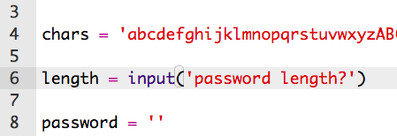

## पासवर्ड की लंबाई चुनना

कुछ वेबसाइटों को एक निश्चित लंबाई के पासवर्ड की आवश्यकता होती है। आइए उपयोगकर्ता को उसके पासवर्ड की लंबाई चुनने की अनुमति दें।

+ सबसे पहले, उपयोगकर्ता से पासवर्ड लंबाई इनपुट करने के लिए कहें, और इसे `length `नामक वेरिएबल(variable) में सेव करें।

    

+ उपयोगकर्ता के इनपुट को संख्या में बदलने के लिये `int()`का उपयोग करें|

    

+ उपयोगकर्ता जितनी बार डाले उतनी बार अपने `length` वेरिएबल(variable) का उपयोग करें।

    

+ अपने कोड का परीक्षण(Test) करें। बनाया गया पासवर्ड उपयोगकर्ता द्वारा डाली गइ लंबाई जितना होना चाहिए।

    

