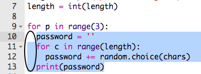

## बहुत सारे पासवर्ड

आइए उपयोगकर्ता को एक साथ 3 पासवर्ड बनाने की अनुमति दें।

+ 3 पासवर्ड बनाने के लिए इस कोड को जोड़ें:

    

+ पासवर्ड बनाने के लिए कोड को हाइलाइट करें, और इंडेंट(indent) करने के लिए Tab को दबाएं ताकि वह 3 बार दोहराए।

    

+ अपने नए कोड का परीक्षण(Test) करें। अब आपको अपनी चुनी हुई पासवर्ड लंबाई के 3 पासवर्ड दिखाइ देंगे।

    

