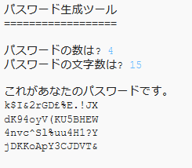

## はじめに

インターネットを使う上で、自分の個人情報を守ることは大切です。このプロジェクトでは、パスワードを生成するツールを作ります。

パスワードはランダムに作られるので、だれにも当てられません。

  <iframe src="https://trinket.io/embed/python/5a39ec5ed2?outputOnly=true&start=result" width="600" height="500" frameborder="0" marginwidth="0" marginheight="0" allowfullscreen>
  </iframe>
  

### クラブリーダーのための追加情報

このプロジェクトを印刷する必要がある場合は、 [印刷用バージョン](https://projects.raspberrypi.org/ja-JP/projects/password-generator/print)を使用してください。

--- collapse ---
---
title: クラブリーダー用ノート
---

## はじめに

このプロジェクトでは、子どもたちはどんなパスワードが良いパスワードなのかを学びます。そして、ランダムに生成されたパスワードを作成するプログラムの作り方を学びます。

このプロジェクトは、2017年2月7日に開催された Safer Internet Day 2017 向けに作成されました。 Safer Internet Day の目的は、子どもや若者のための安全で責任あるテクノロジーの使用の促進です。 詳細については、[saferinternet.org.uk](https://www.saferinternet.org.uk/) (英語) をご覧ください。 [7〜11歳向けの教材](https://d1afx9quaogywf.cloudfront.net/cdn/farfuture/_-EgL7dYtxtypvvDcNCE53bYE-OMfdH59vaJ5XPcoG4/mtime:1483547665/sites/default/files/SID2017%20Education%20Pack%20for%207-11%20year%20olds_0.zip) (英語) には、追加のリソースが含まれています。

## オンライン・リソース

__このプロジェクトではPython 3を使います。__オンライン上でPythonを書ける[Trinket](https://trinket.io/)を使うことをおすすめします。 本プロジェクトには、以下のTrinketが用意されています。

+ [新しい（空白の）Python Trinket - jumpto.cc/python-new](http://jumpto.cc/python-new)

また、完成したプログラムが入力済みのtrinketもあります。

+ [完成した「パスワード生成ツール」- trinket.io/python/5a39ec5ed2](https://trinket.io/python/5a39ec5ed2)

## オフライン・リソース
このプロジェクトは[オフラインで完成させる](https://www.codeclubprojects.org/en-GB/resources/python-working-offline/)こともできます。

完成したプロジェクトは、「ボランティアリソース」セクションにあり、以下を含んでいます。

+ password-creator-finished/passwords.py

（上記の全リソースはプロジェクト用およびボランティア用に`.zip` ファイルとしてダウンロードできます。）

## 学習のねらい
+ 繰り返し
+ `random.choice()`メソッド

このプロジェクトでは [Raspberry Pi デジタル・メイキング・カリキュラム](http://rpf.io/curriculum)（英語）の柱の一つである、プログラミングの以下の要素を含みます。

+ [プログラミング構造を組み合わせて問題を解決する。](https://www.raspberrypi.org/curriculum/programming/builder)

## チャレンジ
+ 「もっと安全なパスワードを作る」 <a href="https://howsecureismypassword.net/" target="_blank">howsecureismypassword.net</a> (英語) を使って安全なパスワードを作る
+ 「数字と記号を使う」 文字列変数に数字と記号を追加して、より広い範囲からパスワードに使う文字を選択できるようにする
+ 「長いパスワード」文字をランダムに選択する回数を変更する
+ 「パスワードの数を選ぶ」変数を使用して必要なパスワードの数を指定できるようにする

--- /collapse ---

--- collapse ---
---
title: プロジェクト資料
---
## プロジェクトリソース
* [全プロジェクトリソースの入った.zipファイル](resources/password-generator-resources.zip)
* [オンラインの Python Trinket (空白)](http://jumpto.cc/python-new)
* [オフラインの Python ファイル (空白)](resources/new-new.py)

## クラブリーダー用資料
* [全ての完成版プロジェクトリソースの入った.zipファイル](resources/password-generator-finished.zip)
* [完成した Trinket プロジェクト (オンライン)](https://trinket.io/python/5a39ec5ed2)
* [完成したプロジェクト (オフライン)](resources/password-generator-finished-passwords.py)

--- /collapse ---
