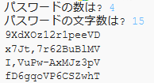

--- challenge ---
## チャレンジ: パスワードの数を選ぶ
いつも3つのパスワードを表示するのではなく、ユーザーが希望するパスワードの数を入力できるようにすることはできますか？

Run をおすと、このように表示されます。

必要なコードは、パスワードの`文字数`を入力するコードに __とても__ 似ています。

--- /challenge ---

***
このプロジェクトは以下のボランティアによって翻訳されました。

松原慧子

大野 雅利

ボランティアのおかげで、世界中の人々に母国語で学ぶ機会を与えることができます。翻訳を引き受けていただくことで、より多くの人々に手を差し伸べることができます。詳しくは [rpf.io/translate](https://rpf.io/translate) をご覧ください。