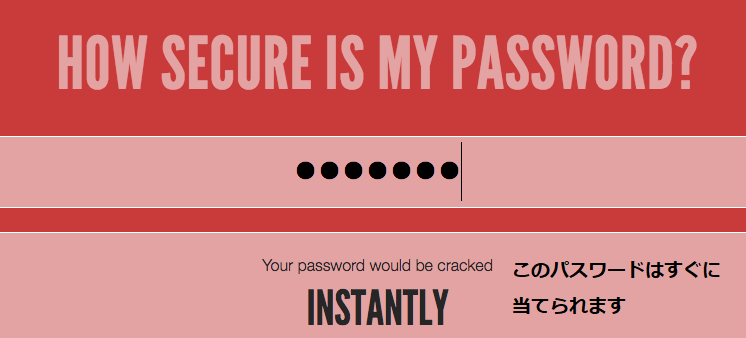

## パスワードはどのくらい安全ですか？

コンピューターは「総当たり攻撃 (こうげき) 」でパスワードを当てようとする可能性があります。これは正しいパスワードに当たるまで、たくさんのパスワードを試すということです。

コンピューターがパスワードを当てるのにどれくらい時間がかかるかを調べましょう。

+ Go to <a href="https://www.security.org/how-secure-is-my-password/" target="_blank">www.security.org/how-secure-is-my-password/</a>, which is a website for finding out how secure your passwords are.

    

+ パスワードとして「letmein」（私を入れてください）と入力してください。 You'll see that a computer would guess this password extremely quickly!

    

    There are some reasons why "letmein" isn't a good password to use:

    + とても__一般的な__パスワード（一番使われる15のパスワードの1つ）だからです。 コンピューターは、このようなパスワードをまず試します。

    + __辞書にのっている__単語がふくまれています。 コンピューターはこのようなパスワードも最初に試します。

    + とても__短い__パスワードです 。 長いパスワードをコンピューターが当てるには、より多くの時間がかかります。

    + __文字__のみがふくまれています。 数字と記号もふくまれているパスワードの方が安全です。

+ 辞書にのっている単語を入力してみてください。 コンピュータがそのパスワードを当てるのにどれくらいの時間がかかりますか？ 

