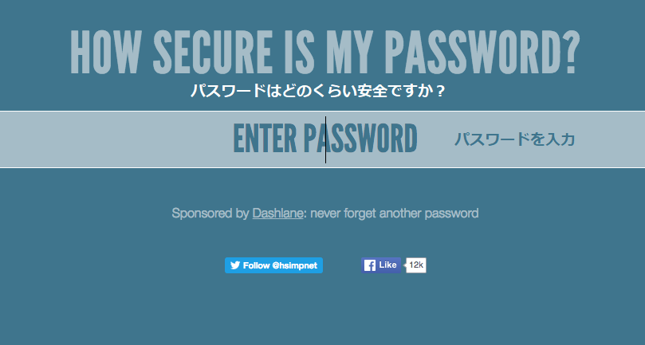

## パスワードはどのくらい安全ですか？

コンピューターは「総当たり攻撃 (こうげき) 」でパスワードを当てようとする可能性があります。これは正しいパスワードに当たるまで、たくさんのパスワードを試すということです。

コンピューターがパスワードを当てるのにどれくらい時間がかかるかを調べましょう。

+ <a href="https://howsecureismypassword.net/" target="_blank">howsecureismypassword.net</a> (英語) にアクセスしましょう。これはパスワードの安全性を知るためのウェブサイトです。

    

+ パスワードとして「letmein」（私を入れてください）と入力してください。 コンピューターはこのパスワードを__すぐに__当ててしまいます！

    

    また、「letmein」がなぜ安全なパスワードではないかが分かります。

    + とても__一般的な__パスワード（一番使われる15のパスワードの1つ）だからです。 コンピューターは、このようなパスワードをまず試します。

    + __辞書にのっている__単語がふくまれています。 コンピューターはこのようなパスワードも最初に試します。

    + とても__短い__パスワードです 。 長いパスワードをコンピューターが当てるには、より多くの時間がかかります。

    + __文字__のみがふくまれています。 数字と記号もふくまれているパスワードの方が安全です。

+ 辞書にのっている単語を入力してみてください。 コンピュータがそのパスワードを当てるのにどれくらいの時間がかかりますか？ 

