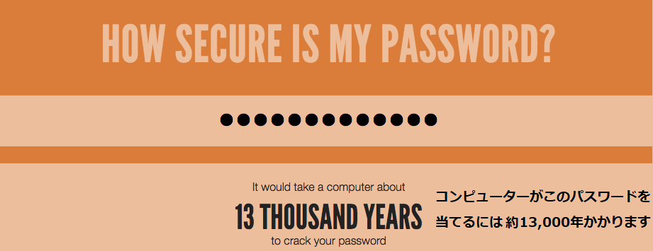

--- challenge ---
## チャレンジ: もっと安全なパスワードを作る
入力するには長すぎないけれども、コンピュータが解読するのに1,000年以上かかるパスワードを入力できますか？

このようなパスワードが当てられにくいパスワードです。

+ 長い
+ 辞書にない単語
+ 文字、数字、記号をふくむ

コンピューターが解読しにくいパスワードを生成します。 このようなパスワードは重要なアカウントを守るのに役立ちます。 大人の多くは、たくさんのむずかしいパスワードを覚えるのにパスワードマネージャーというプログラムを使っています。

--- /challenge ---