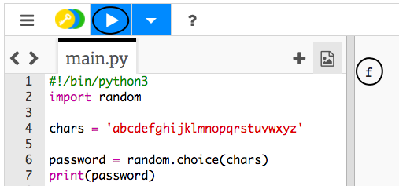

## ランダムな文字

パスワードにランダムな文字を選ぶプログラムを作りましょう。

+ 空白のPythonテンプレートTrinketを開きます。 <a href="http://jumpto.cc/python-new" target="_blank">jumpto.cc/python-new</a>
+ `chars` (『文字』という英単語を短くしたもの) という名前の変数に格納 (かくのう) する、英文字のリストを作成します。

    

+ ランダムな文字を選ぶようにするには、`random` (ランダム) モジュールを`import` (インポート) する必要があります。

    

+ リストからランダムな文字を選び、`password` (パスワード) という名前の変数に格納することができます。

    

+ そして、（とても短い）パスワードを画面に表示できます。

    

+ Run をクリックして、プロジェクトをテストしましょう。 画面にランダムな文字が1つ表示されます。

    

    プログラムを数回実行すると、別の文字が表示されるはずです。

+ パスワードは文字だけではあまり安全ではありません。 `chars` 変数に数字を追加しましょう。

    

+ コードを何回かテストすると、パスワードに数字が選ばれることがあります。

