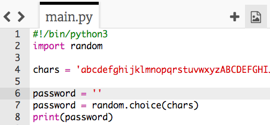

## ランダムなパスワード

パスワードは1文字だけではあまり意味がありません。プログラムを改良して、より長いパスワードを作成するようにしましょう。

+ パスワードを作成するには、ランダムな文字を1つずつ追加します。

    まず、`password` 変数は空でなければなりません。 コードにこの行を追加します。

    

+ ランダムな文字を10回選ぶようにします。 これを行うには、次のコードを追加します。

    

+ ランダムな文字を10回選ぶようにするには、行をインデント（字下げ）する必要があります。

    インデントするには、「tab」キーをおします。

    

+ パスワードに新しい文字列を__追加__していくには、`+=`を使います。

    

+ 新しいコードをテストすると、10文字のパスワードが表示されます。

    

