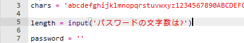
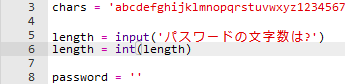
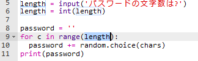

## パスワードの文字数を選ぶ

ウェブサイトによっては、パスワードを一定の文字数にする必要があります。 ユーザーがパスワードの文字数を選べるようにしましょう。

+ まずユーザーにパスワードの文字数を入力してもらい、それを `length` (長さ) という変数に格納します。

    

+ `int()`を使用して、ユーザーの入力を整数にします。

    

+ `length` 変数を使い、ユーザーが入力した回数だけくり返します。

    

+ コードをテストしましょう。 作成されたパスワードは、ユーザーが入力した文字数である必要があります。

    

