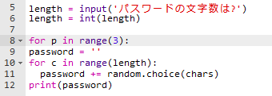
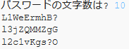

## たくさんのパスワード

ユーザーが一度に3つのパスワードを作成できるようにしましょう。

+ このコードを追加して、3つのパスワードを作成するようにします。

    

+ 3回くり返されるようにするには、パスワードを作成するコードを反転表示し、Tabキーをおしてインデントします。

    

+ 新しいコードをテストしましょう。 選んだ文字数のパスワードが3つ分表示されます。

    

