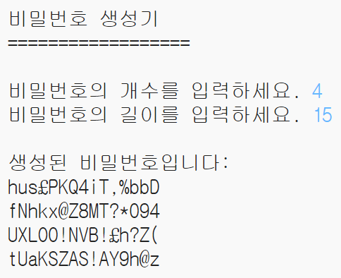

## 소개:

온라인에서 개인 정보를 보호하는 것이 중요합니다. 따라서 이 프로젝트에서는 암호를 생성하는 프로그램을 만들어 볼 것입니다.

암호는 랜덤이므로 아무도 추측할 수 없을 것입니다!

  <iframe src="https://trinket.io/embed/python/08c0ad3359?outputOnly=true&start=result" width="600" height="500" frameborder="0" marginwidth="0" marginheight="0" allowfullscreen>
  </iframe>
  

### 교육자들을 위한 추가 정보

이 프로젝트를 인쇄하려면 [프린트용 문서](https://projects.raspberrypi.org/en/projects/password-generator/print)를 사용하십시오.

--- collapse ---
---
title: 교육자 노트
---

## 소개

이 프로젝트에서 학생들은 좋은 암호를 만드는 방법과 랜덤 암호를 생성하는 프로그램을 짜는 법에 대해 배웁니다.

이 프로젝트는 2017년 2월 7일에 열리는 2017년 '안전한 인터넷의 날'을 위해 작성되었습니다. '안전한 인터넷의 날'의 목표는 젊은이들에게 안전하고 책임감 있는 기술 사용을 장려하는 것입니다. 자세한 정보가 필요하다면 [saferinternet.org.uk](https://www.saferinternet.org.uk/)를 방문하여 [7-11세 어린이를 위한 교육 팩](https://d1afx9quaogywf.cloudfront.net/cdn/farfuture/_-EgL7dYtxtypvvDcNCE53bYE-OMfdH59vaJ5XPcoG4/mtime:1483547665/sites/default/files/SID2017%20Education%20Pack%20for%207-11%20year%20olds_0.zip)의 추가 리소스를 참고하세요.

## 온라인 자료

__이 프로젝트는 Python 3를 사용합니다.__ 파이썬 코드를 온라인에서 작성하기 위해 [Trinket](https://trinket.io/)을 사용하는 것을 추천합니다. 이 프로젝트에 포함된 Trinket은 다음과 같습니다:

+ [새로운(비어있는) 파이썬 Trinket -- jumpto.cc/python-new](http://jumpto.cc/python-new)

완성된 프로젝트를 포함한 Trinket도 있습니다:

+ [완성된 '비밀번호 생성기' -- trinket.io/python/08c0ad3359](https://trinket.io/python/08c0ad3359)

## 오프라인 자료
여러분의 선호에 따라 프로젝트를 [오프라인에서 완성](https://www.codeclubprojects.org/en-GB/resources/python-working-offline/)할 수 있습니다.

완성된 프로젝트는 '자원 봉사자 자원' 섹션에서 찾을 수 있으며, 다음의 파일들을 포함합니다.

+ password-creator-finished/passwords.py

(또한 위의 모든 자료는 프로젝트 및 자원봉사자 `.zip` 파일로 다운로드 할 수 있습니다.)

## 학습 목표
+ 반복문 사용하기;
+ `random.choice()` 메소드 사용하기;

이 프로젝트는 [라즈베리파이 디지털 메이킹 커리큘럼](http://rpf.io/curriculum) 중 아래의 과정에 있는 요소들을 다룹니다.

+ [프로그래밍 구조를 결합하여 문제 해결하기](https://www.raspberrypi.org/curriculum/programming/builder)

## 도전과제
+ "더 안전한 암호 만들기" - <a href="https://howsecureismypassword.net/" target="_blank">howsecureismypassword.net</a>를 사용하여 더 안전한 암호를 생성합니다.
+ "숫자 및 특수 문자 사용하기"-문자열 변수에 텍스트를 추가하여 랜덤 문자를 더 폭넓게 선택할 수 있습니다.
+ "긴 암호 만들기" - 랜덤 문자를 뽑는 횟수를 변경합니다.
+ "암호의 개수 선택하기" - 변수를 사용하여 필요한 암호의 수를 지정합니다.

--- /collapse ---

--- collapse ---
---
title: 프로젝트 자료
---
## 프로젝트 리소스
* [프로젝트의 모든 자료가 들어있는 .zip 파일](resources/password-generator-resources.zip)
* [온라인 파이썬 공백 Trinket 창](http://jumpto.cc/python-new)
* [오프라인 파이썬 공백 파일](resources/new-new.py)

## 교육자를 위한 자료
* [완료된 프로젝트 리소스가 담긴 .zip 파일](resources/password-generator-finished.zip)
* [완성된 온라인 Trinket 프로젝트](https://trinket.io/python/08c0ad3359)
* [완료된 오프라인 프로젝트](resources/password-generator-finished-passwords.py)

--- /collapse ---
