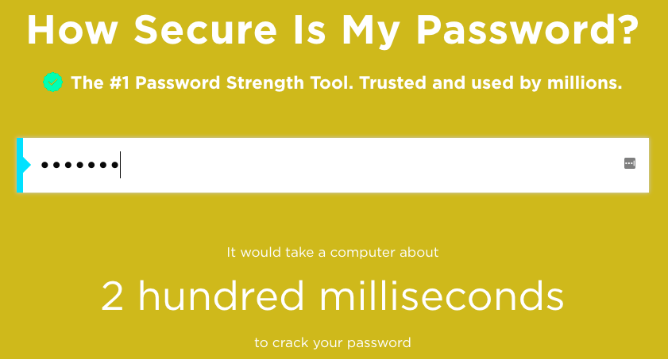

## 당신의 비밀번호는 얼마나 안전한가요?

컴퓨터는 '무차별 대입'을 사용하여 암호를 추측 할 수 있습니다. 즉, 올바른 암호를 맞출 때까지 많은 암호를 추측하여 시도할 수 있습니다.

컴퓨터가 암호를 추측하는 데 걸리는 시간을 알아봅시다.

+ 당신의 비밀번호가 얼마나 안전한지 알아보기 위한 웹사이트인 <a href="https://howsecureismypassword.net/" target="_blank"> howsecureismypassword.net</a>으로 이동하세요.

    

+ 암호로 "letmein"(Let me in)을 입력합니다. 컴퓨터가 __즉각적으로(instantly)__ 이 비밀번호를 추측할 수 있다는 것을 확인할 수 있습니다!

    

    "letmein"이 사용하기에 좋은 암호가 아닌 몇 가지 이유에 대해 알아봅시다:

    + 매우 __흔한__ 암호입니다(가장 자주 사용되는 15개의 암호 중 하나입니다). 컴퓨터는 당연히 이것을 먼저 추측 할 것입니다.

    + __사전__에 등재된 단어가 포함되어 있습니다. 컴퓨터는 이러한 암호 역시 먼저 시도해 볼 것입니다.

    + 매우 __짧습니다__. 컴퓨터는 긴 암호를 추측하는 데 더 많은 시간이 걸립니다.

    + __알파벳__ 만을 포함하고 있습니다. 암호에 숫자와 특수 문자가 포함되어 있으면 더 안전합니다.
 
+ 사전에 등재된 단어를 입력해보세요. 컴퓨터가 그 암호를 추측하는 데에는 시간이 얼마나 걸릴까요? 

