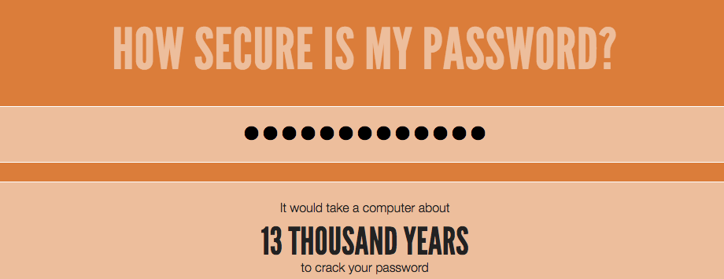

--- challenge ---
## 도전과제: 더 안전한 암호 만들기
컴퓨터가 해독하는 데 1,000년 이상이 걸리지만 입력하기에 지나치게 길지는 않은 암호를 생각할 수 있나요?

다음과 같은 암호는 추측하기가 어렵습니다:

+ 암호가 길 때
+ 사전에 등재된 단어를 사용하지 않을 때
+ 문자, 숫자 및 특수문자를 모두 포함할 때

이제 컴퓨터가 해독하기 어려운 암호를 생성 할 것입니다. 이런 암호는 중요한 계정을 보호하는 데 유용합니다. 실제로 많은 어른들은 암호 관리자 프로그램을 사용하여 까다로운 암호를 기억하기 위해 노력합니다.

--- /challenge ---