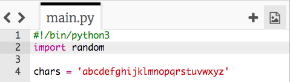

## 랜덤 문자

암호에 사용할 임의의 문자를 선택하는 프로그램을 만들어 보겠습니다.

+ 빈 파이썬 템플릿을 엽니다. <a href="http://jumpto.cc/python-new" target="_blank"> jumpto.cc/python-new</a>.
+ `chars`라는 변수에 저장된 문자열을 만듭니다.

    

+ 랜덤 문자를 선택하려면 `random` 모듈을 `import`합니다.

    

+ 이제 목록에서 랜덤 문자를 선택하고 `password`라는 변수에 저장할 수 있습니다.

    

+ 마지막으로 (매우 짧은!) 암호를 화면에 인쇄할 수 있습니다.

    

+ Run 을 클릭하여 프로그램을 테스트하세요. 화면에 하나의 랜덤 문자가 표시되어야 합니다.

    

    프로그램을 몇 번 실행하면 다른 문자가 나타납니다.

+ 문자만 포함된 암호는 그다지 안전하지 않습니다. `chars` 변수에 숫자 몇 개를 추가해보세요.

    

+ 코드를 몇 번 다시 테스트하다보면 때때로 숫자가 선택되는 것을 볼 수 있습니다.

