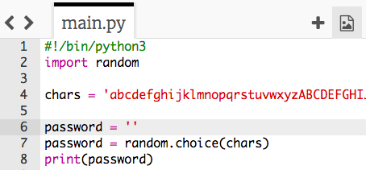
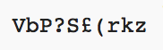

## 랜덤 암호

단일 문자는 그다지 유용하지 않습니다. 더 긴 암호를 생성하도록 프로그램을 개선합시다.

+ 암호를 만들려면 한 번에 하나씩 랜덤 문자를 추가합니다.

    먼저 `password` 변수는 비어있어야 합니다. 다음 코드를 프로그램에 추가해 보세요:

    

+ 랜덤 문자를 10번 선택하고자 합니다. 다음 코드를 추가해보세요:

    

+ 줄을 들여써야만 랜덤 문자를 10번 반복해서 선택하게끔 할 수 있습니다.

    들여 쓰려면 'tab' 키를 누르세요.

    

+ 반복될 때마다 새로운 문자를 __더하기__ 위해서는 `+=`을 사용해야 합니다.

    

+ 새 코드를 테스트하면 10자 길이의 암호가 표시됩니다.

    

