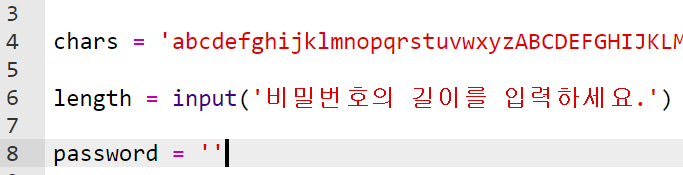
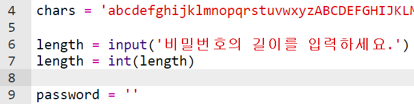
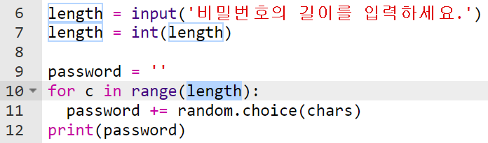
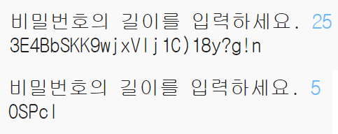

## 암호 길이 선택하기

일부 웹사이트에서는 특정 길이의 암호를 요구합니다. 사용자가 암호 길이를 선택할 수 있도록 합시다.

+ 먼저 사용자에게 암호 길이를 입력하도록 요청하고 이를 `length`라는 변수에 저장합니다.

    

+ `int()` 함수를 이용하여 사용자의 입력을 정수로 바꿔줍니다.

    

+ `length` 변수를 사용자가 입력 한 횟수만큼 반복하는 데에 사용하세요.

    

+ 코드를 테스트해 보세요. 생성한 비밀번호는 사용자가 입력한 길이와 같아야 합니다.

    

