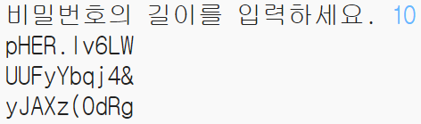

## 많은 암호 생성하기

사용자가 한 번에 3개의 비밀번호를 만들 수 있도록 합시다.

+ 다음 코드를 추가하여 3개의 비밀번호를 만듭니다:

    

+ 암호를 만들기 위한 코드를 선택하고 이 코드가 3회 반복되도록 tab 키를 눌러 들여씁니다.

    

+ 새로워진 여러분의 코드를 테스트해 보세요. 이제 사용자가 선택한 비밀번호 길이를 가진 3 개의 비밀번호가 표시될 것입니다.

    

