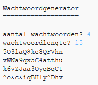

## Inleiding

Het is belangrijk om je persoonlijke informatie online te beschermen, en in dit project maak je een programma om wachtwoorden voor je te genereren.

De wachtwoorden zijn willekeurig, dus niemand zal ze kunnen raden!

  <iframe src="https://trinket.io/embed/python/62f43ce37d?outputOnly=true&start=result" width="600" height="500" frameborder="0" marginwidth="0" marginheight="0" allowfullscreen>
  </iframe>
  

### Aanvullende informatie voor clubleiders

Als je dit project wilt afdrukken, gebruik dan de [printervriendelijke versie](https://projects.raspberrypi.org/nl-NL/projects/password-generator/print).

--- collapse ---
---
title: Opmerkingen voor docenten
---

## Inleiding

In dit project leren kinderen wat een goed wachtwoord is en hoe ze een programma kunnen maken dat willekeurig gegenereerde wachtwoorden maakt.

Dit project is geschreven voor Safer Internet Day 2017, dat was op 7 februari 2017. Het doel van een veiliger internetdag is het bevorderen van het veilige en verantwoorde gebruik van technologie voor jongeren. Ga voor meer informatie naar [saferinternet.org.uk](https://www.saferinternet.org.uk/) waar je een [onderwijspakket voor 7-11-jarigen](https://d1afx9quaogywf.cloudfront.net/cdn/farfuture/_-EgL7dYtxtypvvDcNCE53bYE-OMfdH59vaJ5XPcoG4/mtime:1483547665/sites/default/files/SID2017%20Education%20Pack%20for%207-11%20year%20olds_0.zip) kunt vinden met aanvullende bronnen.

## Online bronnen

__Dit project maakt gebruik van Python 3.__ We raden aan om [Trinket](https://trinket.io/) te gebruiken om Python online te schrijven. Dit project bevat de volgende Trinkets:

+ [Nieuwe (lege) Python Trinket - jumpto.cc/python-new](http://jumpto.cc/python-new)

Er is ook een trinket met het voltooide project:

+ [‘Wachtwoordgenerator’ voltooid - trinket.io/python/62f43ce37d](https://trinket.io/python/62f43ce37d)

## Offline bronnen
Dit project kan [offline worden voltooid](https://www.codeclubprojects.org/en-GB/resources/python-working-offline/) als dit de voorkeur heeft.

Je kunt een voltooide versie van dit project vinden in de sectie 'Vrijwilligersbronnen', die het volgende bevat:

+ password-creator-finished/passwords.py

(Alle bovenstaande bronnen kunnen ook worden gedownload als project en als vrijwilliger `.zip` bestanden.)

## Leerdoelen
+ Herhaling;
+ De `random.choice()` methode;

Dit project behandelt elementen uit de volgende onderdelen van het [Raspberry Pi Digital Making Curriculum](http://rpf.io/curriculum):

+ [Combineer programmeerconstructies om een ​​probleem op te lossen.](https://www.raspberrypi.org/curriculum/programming/builder)

## Uitdagingen
+ "Een beter wachtwoord maken" - gebruik <a href="https://howsecureismypassword.net/" target="_blank">howsecuremypassword.net</a> om veilige wachtwoorden te maken.
+ "Gebruik van cijfers en leesteken" - voeg tekst toe aan een tekenreeksvariabele, wat een bredere keuze van willekeurige tekens geeft.
+ "Een langer wachtwoord" - wijzig het aantal keren dat een willekeurig teken wordt gekozen.
+ "Het aantal wachtwoorden kiezen" - met behulp van een variabele om het aantal vereiste wachtwoorden op te geven.

--- /collapse ---

--- collapse ---
---
title: Projectmaterialen
---
## Projectbronnen
* [.zip-bestand met alle projectbronnen](resources/password-generator-resources.zip)
* [Online lege Python Trinket](http://jumpto.cc/python-new)
* [Offline leeg Python-bestand](resources/new-new.py)

## Clubleider middelen
* [.zip-bestand met alle voltooide projectbronnen](resources/password-generator-finished.zip)
* [Online voltooid Trinket-project](https://trinket.io/python/62f43ce37d)
* [Offline voltooid project](resources/password-generator-finished-passwords.py)

--- /collapse ---
