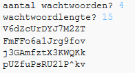

--- challenge ---
## Uitdaging: het aantal wachtwoorden kiezen
Kun je, in plaats van altijd 3 wachtwoorden af te drukken, de gebruiker toestaan het aantal wachtwoorden in te voeren dat hij wil?

Zo zou je programma moeten werken:

De code die je nodig hebt is __erg__ vergelijkbaar met de code voor het invoeren van de `lengte` van het wachtwoord.

--- /challenge ---