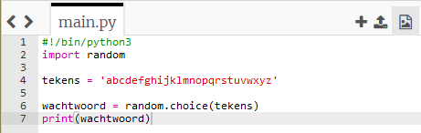

## Willekeurige tekens

Laten we een programma maken om een willekeurig teken voor je wachtwoord te kiezen.

+ Open de lege Python-sjabloon Trinket: <a href="http://jumpto.cc/python-new" target="_blank">jumpto.cc/python-new</a>.
+ Maak een lijst met tekens, opgeslagen in een variabele met de naam `tekens`.

    

+ Om een willekeurig teken te kiezen, moet je een `import` doen van de `random` module.

    

+ Nu kun je een willekeurig teken uit de lijst kiezen en het opslaan in een variabele met de naam `wachtwoord`.

    

+ Tot slot kun je je (zeer korte!) wachtwoord op het scherm afdrukken.

    

+ Test je project door op 'Run' te klikken. Je zou een enkel willekeurig teken op het scherm moeten zien.

    

    Als je het programma een paar keer uitvoert, moet je verschillende tekens zien verschijnen.

+ Een wachtwoord is niet erg veilig als het alleen letters bevat. Voeg wat cijfers toe aan je `tekens` variabele.

    

+ Test je code een paar keer opnieuw en je zou moeten zien dat er soms een cijfer wordt gekozen.

