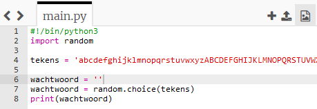
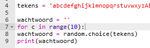
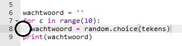
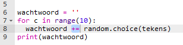

## Een willekeurig wachtwoord

Een enkel teken is niet erg nuttig - laten we je programma verbeteren om een langer wachtwoord te maken.

+ Om een wachtwoord te maken, voeg je er willekeurige karakters aan toe, één tegelijk.

    Om te beginnen moet je `wachtwoord` variabele leeg zijn. Voeg deze regel toe aan je code:

    

+ Je wilt 10 keer een willekeurig teken kiezen. Om dit te doen, voeg de volgende code toe:

    

+ Je moet ook de regel om een willekeurige teken te kiezen laten inspringen (naar rechts), zodat het 10 keer gebeurt.

    Druk op de 'tab'-toets om in te springen.

    

+ Je moet telkens `+=` gebruiken om het nieuwe teken __toe te voegen__ aan het wachtwoord.

    

+ Test je nieuwe code en je zou een wachtwoord moeten zien dat 10 tekens lang is.

    

