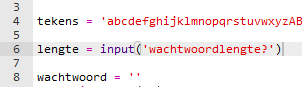
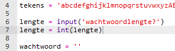
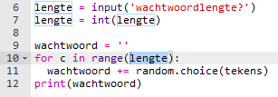
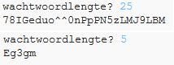

## Een wachtwoordlengte kiezen

Sommige websites vereisen dat wachtwoorden een bepaalde lengte hebben. Laten we ervoor zorgen dat de gebruiker de lengte van zijn wachtwoord kiest.

+ Vraag eerst de gebruiker om een wachtwoordlengte in te voeren en op te slaan in een variabele met de naam `lengte`.

    

+ Gebruik `int()` om de invoer van de gebruiker om te zetten in een geheel getal.

    

+ Gebruik de variabele `lengte` om zoveel keer te herhalen als de gebruiker heeft ingevoerd.

    

+ Test je code. Het wachtwoord dat wordt aangemaakt, moet de lengte hebben die de gebruiker heeft ingevoerd.

    

