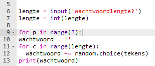
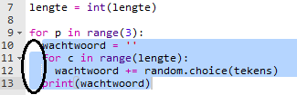
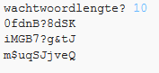

## Veel wachtwoorden

Laten we de gebruiker in staat stellen om 3 wachtwoorden tegelijk te maken.

+ Voeg deze code toe om 3 wachtwoorden te maken:

    

+ Markeer de code voor het maken van een wachtwoord en druk op tab om te inspringen zodat deze 3 keer herhaalt.

    

+ Test je nieuwe code. Je zou nu 3 wachtwoorden van jouw gekozen wachtwoordlengte moeten zien.

    

