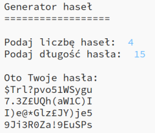

## Wprowadzenie:

To ważne by chronić swoje dane osobowe w Internecie, a więc w tym projekcie stworzysz program, który będzie generował hasła dla Ciebie.

Hasła będą losowe, więc nikt nie będzie w stanie ich odgadnąć!

  <iframe src="https://trinket.io/embed/python/08c0ad3359?outputOnly=true&start=result" width="600" height="500" frameborder="0" marginwidth="0" marginheight="0" allowfullscreen>
  </iframe>
  

### Dodatkowe informacje dla liderów klubów

Jeśli chcesz wydrukować ten projekt, użyj [wersji do druku](https://projects.raspberrypi.org/en/projects/password-generator/print).

--- collapse ---
---
title: Notatki dla liderów klubów
---

## Wprowadzenie:

W tym projekcie dzieci dowiedzą się, co składa się na dobre hasło i jak stworzyć program, który losowo generuje hasła.

Ten projekt został przygotowany z okazji Dnia Bezpiecznego Internetu 2017, który przypada 7 lutego 2017 r. Celem Dnia Bezpiecznego Internetu jest promocja bezpiecznego i odpowiedzialnego korzystania z technologii przez młodych ludzi. Aby uzyskać więcej informacji, odwiedź stronę [saferinternet.org.uk](https://www.saferinternet.org.uk/) gdzie znajdziesz [pakiety edukacyjne dla dzieci w wieku 7-11 lat](https://d1afx9quaogywf.cloudfront.net/cdn/farfuture/_-EgL7dYtxtypvvDcNCE53bYE-OMfdH59vaJ5XPcoG4/mtime:1483547665/sites/default/files/SID2017%20Education%20Pack%20for%207-11%20year%20olds_0.zip) zawierające dodatkowe zasoby.

## Zasoby Online

__Ten projekt używa Python 3.__ Zalecamy użycie [Trinket](https://trinket.io/) do pisania kodu w Pythonie online. Ten projekt zawiera następujące szablony:

+ [Nowy (pusty) Python Trinket - jumpto.cc/python-new](http://jumpto.cc/python-new)

Dostępny jest też Trinket zawierający ukończony projekt:

+ [Ukończony „Generator haseł”- trinket.io/python/08c0ad3359](https://trinket.io/python/08c0ad3359)

## Zasoby Offline
Ten projekt można także [ukończyć offline](https://www.codeclubprojects.org/en-GB/resources/python-working-offline/).

Ukończony projekt można znaleźć w sekcji "Zasoby dla wolontariuszy", która zawiera:

+ password-creator-finished/passwords.py

(Wszystkie powyższe zasoby można również pobrać jako pliki `.zip`.)

## Cele dydaktyczne
+ Iteracja;
+ Metoda `random.choice()`;

Projekt ten obejmuje następujące elementy [Cyfrowego programu nauczania Raspberry Pi](http://rpf.io/curriculum):

+ [Połącz konstrukty programistyczne, aby rozwiązać problem.](https://www.raspberrypi.org/curriculum/programming/builder)

## Wyzwania
+ „Tworzenie lepszego hasła” - skorzystanie z <a href="https://howsecureismypassword.net/" target="_blank">howsecureismypassword.net</a>, aby utworzyć bezpieczne hasło.
+ „Używanie liczb i znaków specjalnych” - dodawanie tekstu do zmiennej przechowującej łańcuch, co daje szerszy wybór losowych znaków.
+ „Dłuższe hasło” - modyfikacja liczby wybieranych losowych znaków.
+ „Wybór liczby haseł” - użycie zmiennej do określenia liczby wymaganych haseł.

--- /collapse ---

--- collapse ---
---
title: Materiały do projektu
---
## Zasoby
* [Plik .zip zawierający wszystkie zasoby potrzebne do wykonania projektu](resources/password-generator-resources.zip)
* [Pusty Trinket Python online](http://jumpto.cc/python-new)
* [Pusty plik Python offline](resources/new-new.py)

## Zasoby dla lidera klubu
* [Plik .zip zawierający wszystkie zasoby ukończonego projektu](resources/password-generator-finished.zip)
* [Ukończony Trinket online](https://trinket.io/python/08c0ad3359)
* [Ukończony projekt offline](resources/password-generator-finished-passwords.py)

--- /collapse ---
