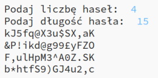

--- challenge ---
## Wyzwanie: wybór liczby haseł
Zamiast zawsze wyświetlać 3 hasła, czy jesteś w stanie umożliwić użytkownikowi wprowadzenie liczby haseł?

Tak powinien działać Twój program:

Kod, którego potrzebujesz, jest __bardzo__ podobny do kodu wczytującego wartość zmiennej `dlugosc`.

--- /challenge ---