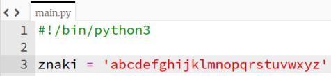

## Losowe znaki

Stwórzmy program, który wybierze losowy znak do Twojego hasła.

+ Otwórz pusty szablon dla języka Python w edytorze Trinket: <a href="http://jumpto.cc/python-new" target="_blank">jumpto.cc/python-new</a>.
+ Utwórz zbiór znaków, przechowywany w zmiennej o nazwie `znaki`.

    

+ Aby wybrać losowy znak, musisz zaimportować moduł random poprzez wpisanie `import` `random`.

    

+ Teraz możesz wybrać losowy znak ze zbioru i zapisać go w zmiennej o nazwie `haslo`.

    

+ Na koniec możesz wyświetlić swoje (bardzo krótkie!) hasło na ekranie.

    

+ Przetestuj swój projekt klikając przycisk „Run”. Na ekranie powinien pojawić się jeden losowy znak.

    

    Jeśli uruchomisz program kilka razy, zobaczysz różne znaki pojawiające się na ekranie.

+ Hasło nie jest zbyt bezpieczne, jeśli zawiera tylko litery. Dopisz kilka liczb do zmiennej `znaki`.

    

+ Jeżeli znów przetestujesz swój kod kilka razy, czasem na ekranie powinna pojawiać się liczba.

