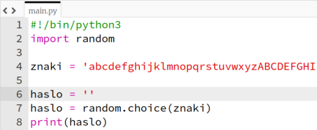
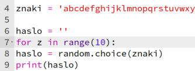
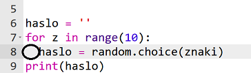
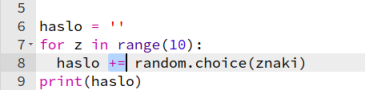

## Losowe hasło

Pojedynczy znak nie jest zbyt przydatny - ulepszmy Twój program, aby utworzyć dłuższe hasło.

+ Aby utworzyć hasło, będziesz dodawać do niego pojedyncze, losowe znaki.

    Na początku zmienna `haslo` powinna być pusta. Dodaj tę linię do swojego kodu:

    

+ Chcesz wybrać losowy znak 10 razy. W tym celu należy dodać następujący kod:

    

+ Powinieneś także wciąć (przesunąć) wiersz, aby wybrać losowy znak 10 razy.

    Aby dodać wcięcie, naciśnij klawisz 'Tab'.

    

+ Musisz użyć `+=` aby za każdym razem __dodać__ nowy znak do hasła.

    

+ Gdy przetestujesz swój nowy kod, na ekranie powinno pojawić się hasło złożone z 10 znaków.

    

