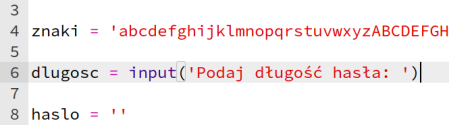
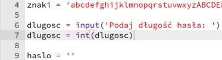
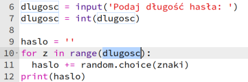
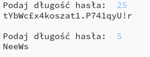

## Wybór długości hasła

Niektóre strony internetowe wymagają haseł o określonej długości. Pozwólmy użytkownikowi wybrać długość hasła.

+ Najpierw poproś użytkownika o wprowadzenie długości hasła, a potem zapisz je w zmiennej o nazwie `dlugosc`.

    

+ Użyj `int()` aby zamienić dane wejściowe na liczbę całkowitą.

    

+ Użyj zmiennej `dlugosc`, aby powtórzyć dodawanie znaku tyle razy, ile chciał użytkownik.

    

+ Przetestuj swój kod. Utworzone hasło powinno mieć długość wprowadzoną przez użytkownika.

    

