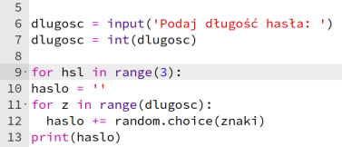
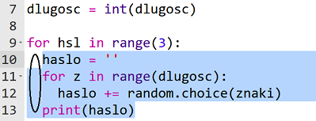
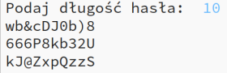

## Mnóstwo haseł

Pozwólmy użytkownikowi stworzyć jednocześnie 3 hasła.

+ Dodaj ten kod, aby utworzyć 3 hasła:

    

+ Zaznacz kod generujący hasła i naciśnij przycisk Tab, aby wciąć go, co umożliwi mu powtarzanie się 3 razy.

    

+ Przetestuj swój nowy kod. Teraz powinny pojawić się 3 hasła o określonej przez Ciebie długości.

    

