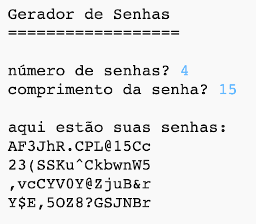

## Introdução:

É importante proteger suas informações pessoais online e, neste projeto, você criará um programa para gerar senhas para você.

As senhas serão aleatórias, portanto ninguém será capaz de adivinhar!

  <iframe src="https://trinket.io/embed/python/73307139f5?outputOnly=true&start=result" width="600" height="500" frameborder="0" marginwidth="0" marginheight="0" allowfullscreen>
  </iframe>
  

### Informação adicional para líderes de clubes

Se você precisar imprimir este projeto, use a [Versão para impressão](https://projects.raspberrypi.org/pt-BR/projects/password-generator/print).

--- collapse ---
---
title: Notas do líder do clube
---

## Introdução:

Neste projeto, as crianças aprenderão o que faz uma boa senha e como criar um programa que crie senhas geradas aleatoriamente.

Este projeto foi escrito para o Dia da Internet Mais Segura 2017, que foi em 7 de fevereiro de 2017. O objetivo do Dia da Internet Mais Segura é promover o uso seguro e responsável da tecnologia para os jovens. Para mais informações, visite [saferinternet.org.uk](https://www.saferinternet.org.uk/) onde você encontrará um [pacote educacional para crianças de 7 a 11 anos](https://d1afx9quaogywf.cloudfront.net/cdn/farfuture/_-EgL7dYtxtypvvDcNCE53bYE-OMfdH59vaJ5XPcoG4/mtime:1483547665/sites/default/files/SID2017%20Education%20Pack%20for%207-11%20year%20olds_0.zip) contendo recursos adicionais.

## Recursos Online

__Este projeto usa Python 3.__Recomendamos usar o [Trinket](https://trinket.io/) para programar Python online. Este projeto contém os seguintes Trinkets:

+ [Novo Trinket Python (em branco) -- jumpto.cc/python-new](http://jumpto.cc/python-new)

Há também um trinket contendo o projeto finalizado:

+ ['Criador de Senhas' concluído -- trinket.io/python/73307139f5](https://trinket.io/python/73307139f5)

## Recursos Offline
Este projeto pode ser [concluído offline](https://www.codeclubprojects.org/en-GB/resources/python-working-offline/), se preferir.

Você pode encontrar o projeto concluído na seção "Recursos para Voluntários", que contém:

+ password-creator-finished/passwords.py

(Todos os recursos acima também podem ser baixados como arquivos `.zip` do projeto e dos voluntários.)

## Objetivos de Aprendizado
+ Repetição;
+ O método `random.choice()`;

Este projeto abrange elementos das seguintes vertentes do [Currículo de Criação Digital Raspberry Pi](http://rpf.io/curriculum):

+ [Combinar construções de programação para resolver um problema.](https://www.raspberrypi.org/curriculum/programming/builder)

## Desafios
+ "Criando uma senha melhor" - usando <a href="https://howsecureismypassword.net/" target="_blank">howsecureismypassword.net</a> para criar senhas seguras.
+ "Usando números e pontuação" - adicionando texto a uma variável do tipo cadeia, oferecendo uma escolha mais ampla de caracteres aleatórios.
+ "Uma senha mais longa" - modificando o número de vezes que um caracter aleatório é escolhido.
+ "Escolhendo o número de senhas" - usando uma variável para especificar o número de senhas necessárias.

--- /collapse ---

--- collapse ---
---
title: Materiais do projeto
---
## Recursos do projeto
* [Arquivo .zip contendo todos os recursos do projeto](resources/password-generator-resources.zip)
* [Trinket de Python em branco online](http://jumpto.cc/python-new)
* [Arquivo Python em branco offline](resources/new-new.py)

## Recursos do líder do clube
* [Arquivo .zip contendo todos os recursos do projeto concluído](resources/password-generator-finished.zip)
* [Projeto Trinket concluído online](https://trinket.io/python/73307139f5)
* [Projeto concluído offline](resources/password-generator-finished-passwords.py)

--- /collapse ---
