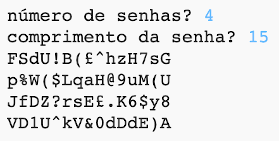

--- challenge ---
## Desafio: Escolhendo o número de senhas
Em vez de sempre imprimir três senhas, você pode permitir que o usuário digite o número de senhas que desejar?

Aqui está como seu programa deve funcionar:

O código que você vai precisar é __muito__ semelhante ao código para entrar o `comprimento` da senha.

--- /challenge ---

***
Tradução Contribuída pela Comunidade

Este projeto foi traduzido por Douglas Reis e revisado por Flavio Silva.

Nossos incríveis voluntários de tradução nos ajudam a dar as crianças em todo o mundo a oportunidade de aprender a programar. Você pode nos ajudar a alcançar mais crianças traduzindo nossos projetos - leia mais em [rpf.io/translate](https://rpf.io/translate).