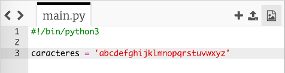
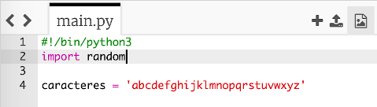
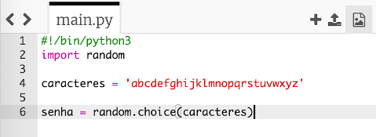
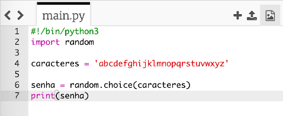
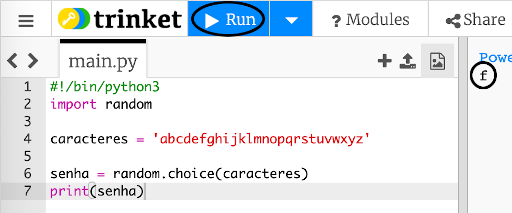
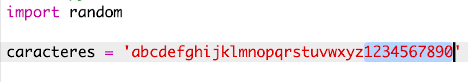

## Caracteres aleatórios

Vamos criar um programa para escolher um caractere aleatório para sua senha.

+ No Trinket abra um modelo em branco do Python: <a href="http://jumpto.cc/python-new" target="_blank">jumpto.cc/python-new</a>.
+ Crie uma lista de caracteres, armazenados em uma variável chamada `caracteres`.

    

+ Para escolher um caractere aleatório, você precisará `importar` o módulo `aleatório`.

    

+ Agora você pode escolher um caractere aleatório da lista e armazená-lo em uma variável chamada `senha`.

    

+ Finalmente, você pode imprimir sua (muito curta!) senha na tela.

    

+ Teste seu código clicando em 'Run'. Você deve ver um único caractere aleatório na tela.

    

    Se você executar o programa algumas vezes, deverá aparecer caracteres diferentes.

+ Uma senha não é muito segura se tiver apenas letras. Adicione alguns números a sua variável `caracteres`.

    

+ Teste seu código novamente algumas vezes e você verá que algumas vezes um número é escolhido.

