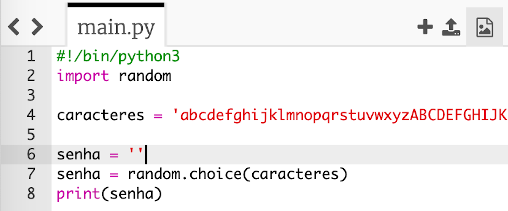
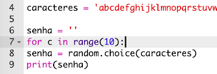
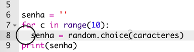
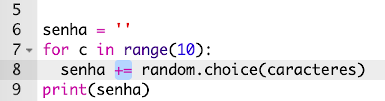

## Uma senha aleatória

Um único caractere não é muito útil - vamos melhorar seu programa para criar uma senha mais longa.

+ Para criar uma senha, você adicionará caracteres aleatórios, um de cada vez.

    Para começar, sua variável `senha` deve estar vazia. Adicione esta linha ao seu código:

    

+ Você quer escolher um caractere aleatório 10 vezes. Para fazer isso, adicione o seguinte código:

    

+ Você também deve indentar (inserir espaço) a linha para escolher um caractere aleatório, para que isso aconteça 10 vezes.

    Para indentar, pressione a tecla 'tab'.

    

+ Você precisa usar `+=` para __adicionar__ o novo caractere na senha a cada vez.

    

+ Teste seu novo código e você verá uma senha com 10 caracteres.

    

