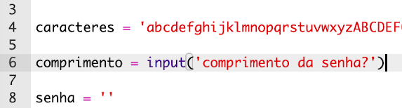
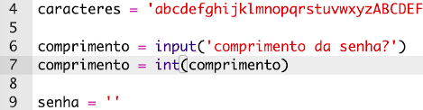
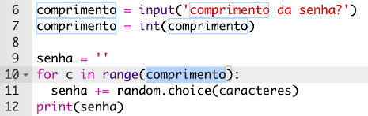
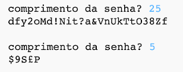

## Escolhendo um tamanho de senha

Alguns sites exigem que as senhas tenham um determinado tamanho. Vamos permitir que o usuário escolha o tamanho de sua senha.

+ Primeiro, peça ao usuário para inserir um tamanho de senha e armazene-o em uma variável chamada `comprimento`.

    

+ Use `int()` para transformar a entrada do usuário em um número inteiro.

    

+ Use sua variável `comprimento` para repetir o número de vezes determinado pelo usuário.

    

+ Teste seu código. A senha criada deve ter o tamanho digitado pelo usuário.

    

