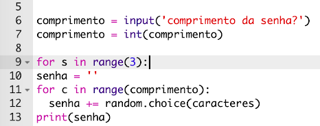
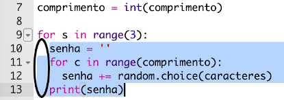
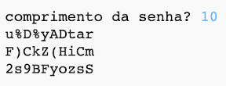

## Muitas senhas

Vamos permitir que o usuário crie três senhas ao mesmo tempo.

+ Adicione este código para criar três senhas:

    

+ Selecione o código para criar uma senha e pressione tab para indentar e fazer com que se repita 3 vezes.

    

+ Teste o seu novo código. Agora você deve ver três senhas com o tamanho escolhido.

    

