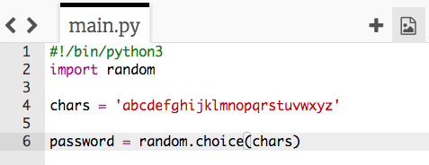

## Random characters

Let's create a program to choose a random character for your password.

+ Open the blank Python template Trinket: <a href="http://jumpto.cc/python-new" target="_blank">jumpto.cc/python-new</a>.
+ Create a list of characters, stored in a variable called `chars`.

    

+ To choose a random character, you'll need to `import` the `random` module.

    

+ Now you can choose a random character from the list, and store it in a variable called `password`.

    

+ Finally, you can print your (very short!) password to the screen.

    

+ Test your project by clicking 'run'. You should see a single random character on the screen.

    

    If you run your program a few times, you should see different characters appear.

+ A password isn't very secure if it only contains letters. Add some numbers to your `chars` variable.

    

+ Test your code again a few times, and you should see that sometimes a number is chosen.

