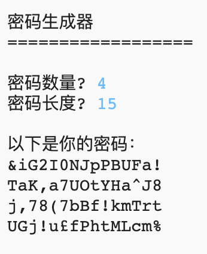

## 介绍：

网络上个人信息保护十分重要。在这个项目中，你将创建一个程序来帮你生成密码。

密码是随机生成的，所以不会被人猜到！

  <iframe src="https://trinket.io/embed/python/08c0ad3359?outputOnly=true&start=result" width="600" height="500" frameborder="0" marginwidth="0" marginheight="0" allowfullscreen>
  </iframe>
  

### 俱乐部导师的附加信息

如果你需要打印此项目，请使用[适合打印的版本](https://projects.raspberrypi.org/en/projects/password-generator/print)。

--- collapse ---
---
title: 俱乐部导师说明
---

## 介绍

在这个项目中，孩子们将学习什么样的密码是好密码，以及如何编写一个程序随机生成密码。

该项目是为2017年2月7日互联网安全日编写的。 其目的是宣传推动年轻人安全、负责任地使用互联网。 欲了解更多信息，请访问[saferinternet.org.uk](https://www.saferinternet.org.uk/)，其中可以找到[面向7-11岁小朋友的教育包](https://d1afx9quaogywf.cloudfront.net/cdn/farfuture/_-EgL7dYtxtypvvDcNCE53bYE-OMfdH59vaJ5XPcoG4/mtime:1483547665/sites/default/files/SID2017%20Education%20Pack%20for%207-11%20year%20olds_0.zip)，包含额外的资源。

## 在线资源

__本项目使用 Python 3__ 我们建议使用 [Trinket](https://trinket.io/) 在线编写Python代码。 这个项目包含如下 Trinkets 代码:

+ [新建（空白）Python Trinket -- jumpto.cc/python-new](http://jumpto.cc/python-new)

还有一个包括已完成项目的Trinket：

+ [已完成的“密码生成器” -- trinket.io/python/08c0ad3359](https://trinket.io/python/08c0ad3359)

## 离线资源
如果你愿意，本项目可以[离线完成](https://www.codeclubprojects.org/en-GB/resources/python-working-offline/)。

你也可以在 “志愿者资源'”部分找到该项目的完成版本，里面包含：

+ password-creator-finished/passwords.py

(上述所有资源也可以以`.zip`压缩包的形式下载。)

## 学习目标
+ 重复;
+ `random.choice()`方法

本项目涵盖[树莓派数字制作课程](http://rpf.io/curriculum)如下几方面内容：

+ [综合利用编程结构解决问题。](https://www.raspberrypi.org/curriculum/programming/builder)

## 挑战
+ “创建更好的密码” - 利用<a href="https://howsecureismypassword.net/" target="_blank">howsecureismypassword.net</a>网站创建安全的密码。
+ “使用数字和标点符号” - 在字符串变量中添加文本，提供更广泛的随机字符选择。
+ “让密码更长” - 修改选择随机字符的次数。
+ “选择密码数量” - 使用变量指定需要的密码数量。

--- /collapse ---

--- collapse ---
---
title: 项目材料
---
## 项目资源
* [包含所有项目资源的.zip压缩包](resources/password-generator-resources.zip)
* [在线空白Python Trinket项目](http://jumpto.cc/python-new)
* [离线空白Python文件](resources/new-new.py)

## 俱乐部导师资源
* [包含所有完整版项目资源的.zip压缩包](resources/password-generator-finished.zip)
* [在线完整版Trinket项目](https://trinket.io/python/08c0ad3359)
* [已完成的离线项目](resources/password-generator-finished-passwords.py)

--- /collapse ---
