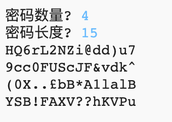

--- challenge ---
## 挑战：选择密码数量
你可以让用户输入他们想要的密码数量，而不是每次总打印三个密码吗？

你的程序应如下所示：

你需要的代码 __非常__ 类似于输入密码`长度` 的代码。

--- /challenge ---

***
该项目由以下志愿者翻译：

Shuyan Liu

权梁锋

正因为志愿者们的辛勤工作，我们才能为世界各地的人们提供用母语来学习的机会。您也可以通过志愿翻译工作来帮助我们吸引更多的人 - 更多信息，请访问[rpf.io/translate](https://rpf.io/translate)。