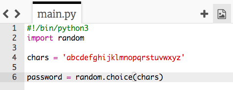

## 随机字符

我们来创建一个程序给你的密码选择一个随机的字符。

+ 单击链接<a href="http://jumpto.cc/python-new" target="_blank">jumpto.cc/python-new</a>，打开空白的Python编码页面。
+ 创建一个字符串，存在一个名为`chars`的变量中。

    

+ 要选择随机字符，你需要`import` (导入) `random`模块。

    

+ 现在你可以从字符串中选择一个随机的字符，把它存到一个名为 `password`的变量中。

    

+ 最后一步，你可以在屏幕上打印你 (超短的) 密码啦！

    

+ 点击‘run’测试你的项目。 你应该能看到屏幕上一个随机字符。

    

    如果你run这个程序几下，应该会发现每次都会显示不同的字符。

+ 只包含字母的密码不是很安全。 往你的`chars`变量中加一些数字吧。

    

+ 再次测试几下你的代码，你会看到有时候选择的是一个数字。

