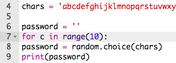

## 随机密码

单个字符没有什么用 - 我们来改进你的程序，创建一个长一些的密码。

+ 你要每次添加一个随机字符来创建密码。

    首先，你的`password`变量应该是空的。 将这一行添加到您的代码中：

    

+ 你想选择一个随机字符10次。 为此我们添加下面这行代码：

    

+ 你还应缩进选择随机字符的这行代码，这样它就可以发生10次了。

    按‘tab’键缩进。

    

+ 你需要用`+=`符号来给password变量每次__add__ (添加) 新字符。

    

+ 测试你的新代码就应该能看到一个10个字符长的密码了。

    

