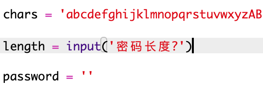
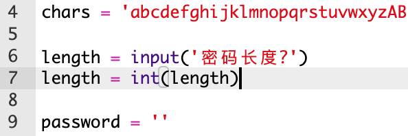
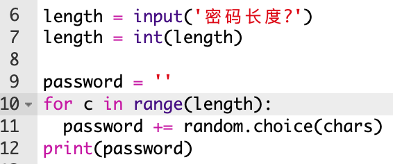
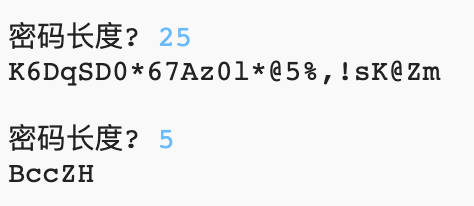

## 选择密码长度

有些网站要求对密码的长度有一定的要求。 我们来让用户可以自定义他们的密码长度。

+ 首先，请用户输入密码的长度，把用户输入的信息存到一个名为`length`的变量中。

    

+ 使用`int()`将用户输入的信息转换成一个整数。

    

+ 使用你的`length`变量重复用户输入的次数。

    

+ 测试你的代码。 创建的密码应该是用户输入的长度。

    

